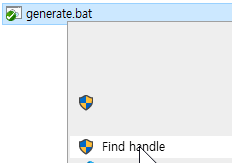
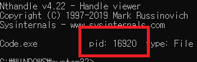
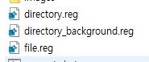

# findhandle 

Context menu tool to find active processes.

### Requirements

- [Handle - Microsoft](https://docs.microsoft.com/en-us/sysinternals/downloads/handle)
- [nircmd - nirsoft](https://www.nirsoft.net/utils/nircmd.html)

### Example ( folder or file in use error )

1. right click and 'find handle' click  
   
2. check pid  
   
3. kill process >`taskkill /pid 16920 /f`

## Fast start

1. run `generate.bat`
2. install requirements
3. setting requirements path  
   * `nircmd` direcoty path  
   * `handle`.exe or `handle64`.exe file path
4. install `*.reg` files  
   
   * file - file context
   * directory - directory context
   * directory background - backgrounds in desktop and directory.
